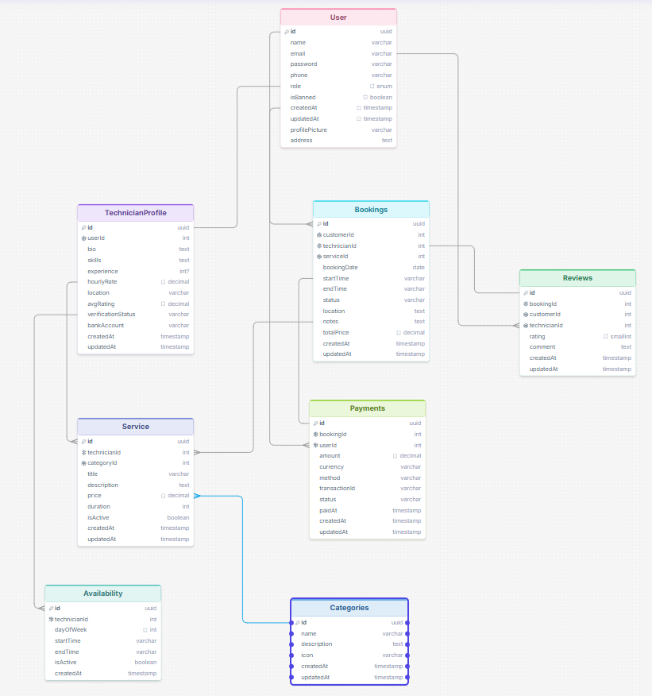

# 🔧 FixItNow Backend API


A robust backend API for a Home Services Marketplace where customers can book technicians, technicians can manage bookings, and admins can manage the platform.


## 📊 ER Diagram



ER Diagram:
https://drawsql.app/teams/shahadat-hossain1/diagrams/fixitnow-b7a4-erd


## 📖 Project Overview

FixItNow is a backend API for a home services marketplace.

The platform allows customers to browse available services, book technicians, make secure payments using Stripe, and submit reviews after service completion.

Technicians can manage their profiles, update availability, and handle booking requests.

Admins oversee users, categories, bookings, and platform management.

---


## ✨ Features

### 🔐 Authentication

- Register
- Login
- Refresh Token
- JWT Authentication
- Role Based Authorization

---

### 👤 Customer

- Browse Services
- Book Services
- View Booking History
- Secure Stripe Payment
- Submit Reviews

---

### 🧑‍🔧 Technician

- Update Profile
- Update Availability
- Accept / Reject Booking
- Complete Service
- View Assigned Bookings

---

### 👑 Admin

- View All Users
- Block / Unblock Users
- Manage Categories
- View All Bookings


## 🛠 Tech Stack

### Backend

- 🟢 Node.js
- ⚡ Express.js
- 🔷 TypeScript

### Database

- 🐘 PostgreSQL
- 🔺 Prisma ORM

### Authentication

- 🔐 JWT
- 🔑 bcrypt

### Payment

- 💳 Stripe

### Validation

- ✅ Zod


---

## 📂 Project Structure

```
src
│
├── config
├── middlewares
├── modules
│   ├── auth
│   ├── user
│   ├── service
│   ├── booking
│   ├── technician
│   ├── payment
│   ├── review
│   ├── category
│   └── admin
│
├── routes
├── utils
└── app.ts
```

---

## ⚙️ Installation

### Clone Repository

```bash
git clone https://github.com/shahadat-web-dev/fixitnow-backend.git
```

### Go to project

```bash
cd fixitnow-backend
```

### Install dependencies

```bash
npm install
```

### Create .env

Create a `.env` file using `.env.example`.

### Run migrations

```bash
npx prisma migrate dev
```

### Generate Prisma Client

```bash
npx prisma generate
```

### Run Development Server

```bash
npm run dev
```

---

## 🔑 Environment Variables

```env
PORT=

DATABASE_URL=

JWT_ACCESS_SECRET=
JWT_REFRESH_SECRET=

JWT_ACCESS_EXPIRES_IN=
JWT_REFRESH_EXPIRES_IN=

BCRYPT_SALT_ROUNDS=

STRIPE_SECRET_KEY=
STRIPE_WEBHOOK_SECRET=

APP_URL=
```

---

## 📌 API Endpoints

### Authentication

| Method | Endpoint |
|---------|----------|
| POST | /api/auth/register |
| POST | /api/auth/login |
| POST | /api/auth/refresh-token |

---

### Services

| Method | Endpoint |
|---------|----------|
| GET | /api/services |
| GET | /api/services/:id |

---

### Categories

| Method | Endpoint |
|---------|----------|
| GET | /api/categories |

---

### Bookings

| Method | Endpoint |
|---------|----------|
| POST | /api/bookings |
| GET | /api/bookings |

---

### Technician

| Method | Endpoint |
|---------|----------|
| PUT | /api/technician/profile |
| PUT | /api/technician/availability |
| GET | /api/technician/bookings |
| PATCH | /api/technician/bookings/:id |

---

### Payments

| Method | Endpoint |
|---------|----------|
| POST | /api/payments/create |
| POST | /api/payments/confirm |
| GET | /api/payments |
| GET | /api/payments/:id |

---

### Reviews

| Method | Endpoint |
|---------|----------|
| POST | /api/reviews |

---

### Admin

| Method | Endpoint |
|---------|----------|
| GET | /api/admin/users |
| PATCH | /api/admin/users/:id |
| GET | /api/admin/bookings |
| GET | /api/admin/categories |
| POST | /api/admin/categories |

---

## 👤 Admin Credentials

```text
Email:
admin@gmail.com

Password:
123456
```

---

## 🧪 Test Card (Stripe)

```text
Card Number:
4242 4242 4242 4242

Expiry:
Any future date

CVC:
Any 3 digits

ZIP:
Any 5 digits
```

---

## 📬 API Documentation

Add your Postman Collection or Swagger documentation here.

---

## 👨‍💻 Author

**Shahadat Hossain**

🌐 Portfolio: https://my-portfolio-y2h5.vercel.app/

💻 GitHub: https://github.com/shahadat-web-dev
